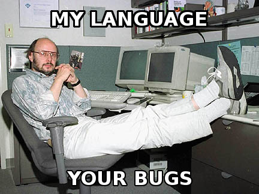

# The C++ Programming Language

- - - 

## Notes and Code Samples Based on Bjarne's Book, **The C++ Programming Language**

**The book is divided into four parts;

* **Part 1: A tour of C++**
* **Part 2: Basic facilities**
* **Part 3: Abstraction mechanisms**
* **Part 4: The Standard Library**

> Each section has multiple chapters that deal with specific subjects and language features

- - -

