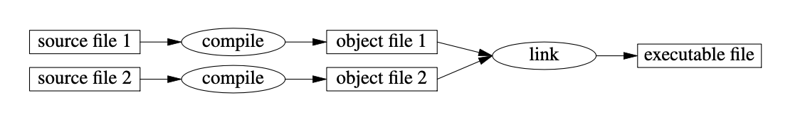

# The C++ Programming Language


- - - 


## Notes and Code Samples Based on Bjarne's Book, **The C++ Programming Language**

## The book is divided into four parts;

* **Part 1: A tour of C++**
* **Part 2: Basic facilities**
* **Part 3: Abstraction mechanisms**
* **Part 4: The Standard Library**

> Each section has multiple chapters that deal with specific subjects and language features

- - -

# Part 1: Introduction

## Sections
* Notes to the reader
* A Tour of C++: The Basics
* A Tour of C++: Abstraction Mechanisms
* A Tour of C++: Containers and Algorithms
* A Tour of C++: Concurrency and Utilities

- - -

C++ is a **compiled langauge**.

For a C++ program to run, 

* It's **source text** has to be processed by a **compiler**, producing **object files**.
* **Object files** are combined by a **linker**, producing an **executable program**



A C++ executable program is created for a specific hardware/system combination and is not portable to say Mac to Windows or Linux Systems. 
C++ source code can however be compiled and run on any hardware/system.

The **ISO C++ Standard** contains two main components:

* **Core Language Features** - such as built in types (**int**, **char** and so on), loops and operators and so on.
* **Standard Library Components** - such as containers (**vectors**, **arrays**), **IO operations** (**<<**, **>>**) and so on.

C++ is **statically typed**

That is, the type of every value is known to the compiler at the time of it's use. The type of value determined the type of operations that can be performed on it.

- - -

> The minimal C++ program is:

```c++
int main() {}
```


